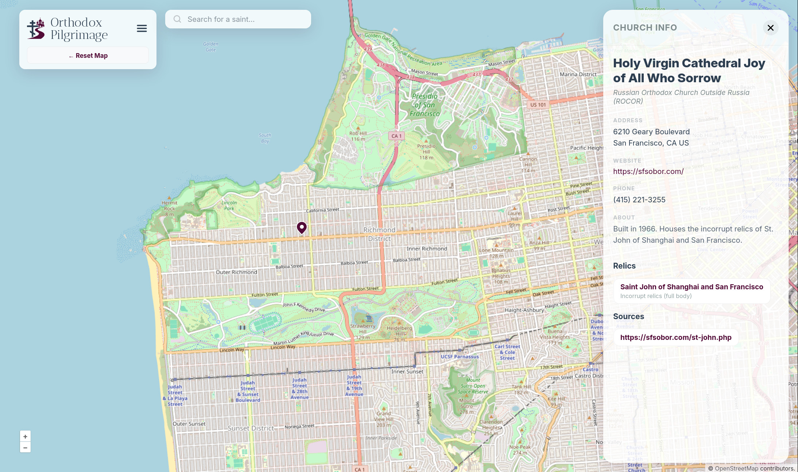

# Orthodox Pilgrimage

Orthodox Pilgrimage is a modern, community-driven web application designed to help the faithful locate and venerate the sacred relics of Orthodox Saints across North America. It provides an interactive, mobile-friendly map to discover holy sites, monasteries, and cathedrals that house these sacred treasures.



## 🚀 Features

- **Interactive Map**: Powered by OpenLayers, providing a fluid experience for discovering churches.
- **Deep Linking**: Every church and saint has its own URL, making it easy to share specific locations.
- **Mobile First**: Optimized for use on the go with a "bottom sheet" interface for church details.
- **Fast & Efficient**: Built with Go and HTMX for a snappy, "Single Page App" feel without the heavy JavaScript overhead.

## 🛠 Tech Stack

- **Backend**: [Go](https://go.dev/) (standard library `net/http`)
- **Database**: SQLite with [sqlc](https://sqlc.dev/) for type-safe queries.
- **Frontend**: HTML Templates, [HTMX](https://htmx.org/), [OpenLayers](https://openlayers.org/) (Maps), and Vanilla CSS.
- **Storage**: AWS S3 compatible object storage (e.g., Tigris) for image uploads.
- **Caching**: Strategy optimized for Cloudflare Edge Caching.

## 🏃 Getting Started

### Prerequisites

- Go 1.26+
- `make`
- `sqlc` (for regenerating database code) `make install/tools`

### Local Development

1.  **Clone the repository**:

    ```bash
    git clone https://github.com/edwlarkey/orthodoxpilgrimage.git
    cd orthodoxpilgrimage
    ```

2.  **Build the application**:

    ```bash
    make build
    ```

3.  **Run the server**:
    ```bash
    ./bin/orthodoxpilgrimage
    ```
    The server will start on `:8080`. The database (`orthodox_pilgrimage.db`) is automatically created and migrated on startup. Use the `--seed` flag to populate it with initial development data.

## 🤝 Contributing

We welcome contributions of all kinds, from bug fixes and feature requests to data updates.

### Contributing Data Updates

The application's data is managed via a secure internal admin interface. 

If you have corrections, new information, or want to add a new church or saint to the map, please reach out to us at info@orthodoxpilgrimage.com or open an issue on GitHub. We'll be happy to add it!

### Contributing Code

1.  Fork the repository.
2.  Create your feature branch (`git checkout -b feature/AmazingFeature`).
3.  Commit your changes (`git commit -m 'Add some AmazingFeature'`).
4.  Push to the branch (`git push origin feature/AmazingFeature`).
5.  Open a Pull Request.

**Styling Note**: We prefer **Vanilla CSS** for all styling. Please avoid adding large CSS frameworks.

## 📜 License

This project is licensed under the **GNU Affero General Public License v3.0 (AGPL-3.0)**. See the [LICENSE](LICENSE) file for details.

---

_Help us keep this map accurate. If you have corrections or new information, reach out at info@orthodoxpilgrimage.com._
